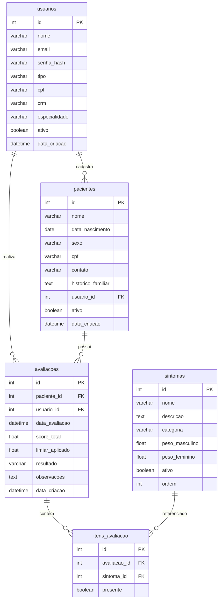

# Plataforma de Avaliacao da Sindrome do X Fragil - IBK

Sistema web desenvolvido para o Instituto Buko Kaesemodel (IBK) com o objetivo de apoiar a triagem da Sindrome do X Fragil. A plataforma permite o cadastro de pacientes, a realizacao de avaliacoes baseadas em uma lista de sintomas com pesos e a geracao de um relatorio que indica (ou nao) o encaminhamento para teste genetico.

Projeto desenvolvido na disciplina **Experiencia Criativa** do 3o semestre de Bacharelado em Ciencia da Computacao (BCC).

## Video Explicativo

Demonstracao do funcionamento e uso do sistema: https://youtu.be/TUVVk8vB2Fk

## Integrantes do Grupo

- Rodrigo Rodrigues Ferreira
- Gabriel Pacheco Benin
- Gabriel Moura
- Daniel

## Tecnologias Utilizadas

- Python 3.11
- Flask (framework web)
- Flask-SQLAlchemy (ORM)
- Flask-Login (autenticacao e sessao)
- PyMySQL (driver de conexao com o MySQL)
- MySQL 8.0 (banco de dados)
- Jinja2 (templates server-side)
- Tailwind CSS via CDN (estilizacao)
- Docker e Docker Compose (containerizacao)

## Perfis de Acesso

- **admin**: acesso total. Cadastra sintomas, usuarios e pacientes e visualiza todas as avaliacoes.
- **profissional**: cadastra pacientes, realiza avaliacoes e visualiza apenas os pacientes e relatorios que cadastrou.
- **paciente**: visualiza apenas os resultados das proprias avaliacoes e pode exportar o relatorio em CSV ou PDF (impressao).

## Regras de Negocio

- O score e a soma dos pesos dos sintomas marcados na avaliacao.
- O peso depende do sexo do paciente (peso masculino ou peso feminino).
- Homens: resultado **Indicado para Teste Genetico** quando o score for maior que 0.56.
- Mulheres: resultado **Indicado para Teste Genetico** quando o score for maior que 0.55.
- Mulheres nao visualizam o sintoma Macro-orquidismo no checklist.
- O calculo do score e do resultado e feito obrigatoriamente no backend.
- A exclusao de pacientes, usuarios e sintomas e logica (campo ativo = falso). As avaliacoes podem ser excluidas fisicamente.

## Como Rodar com Docker

Pre-requisitos: Docker e Docker Compose instalados.

1. Acesse a pasta do projeto:

```
cd ExpCriativaTerceiroSemestre-main
```

2. Suba os containers:

```
docker compose up --build
```

3. Acesse no navegador:

```
http://localhost:5000
```

O banco de dados MySQL e criado automaticamente pelo arquivo `init.sql`, que tambem insere os 12 sintomas iniciais. O usuario administrador padrao e criado automaticamente pela aplicacao.

## Acesso Padrao

- Email: `admin@sistema.com`
- Senha: `admin123`

Recomenda-se alterar a senha apos o primeiro acesso na tela de Perfil.

## Diagrama Entidade-Relacionamento



## Estrutura de Pastas

```
ExpCriativaTerceiroSemestre-main/
  app.py
  config.py
  modelos.py
  rotas_auth.py
  rotas_pacientes.py
  rotas_avaliacoes.py
  rotas_sintomas.py
  rotas_relatorios.py
  rotas_usuarios.py
  requirements.txt
  Dockerfile
  docker-compose.yml
  init.sql
  static/
  templates/
```

## Documentacao Complementar

- `TUTORIAL.md`: passo a passo de uso do sistema por perfil.
- `IMPLANTACAO.md`: guia de implantacao e configuracao do ambiente.
- `DICIONARIO_DADOS.md`: descricao detalhada das tabelas e campos do banco.
